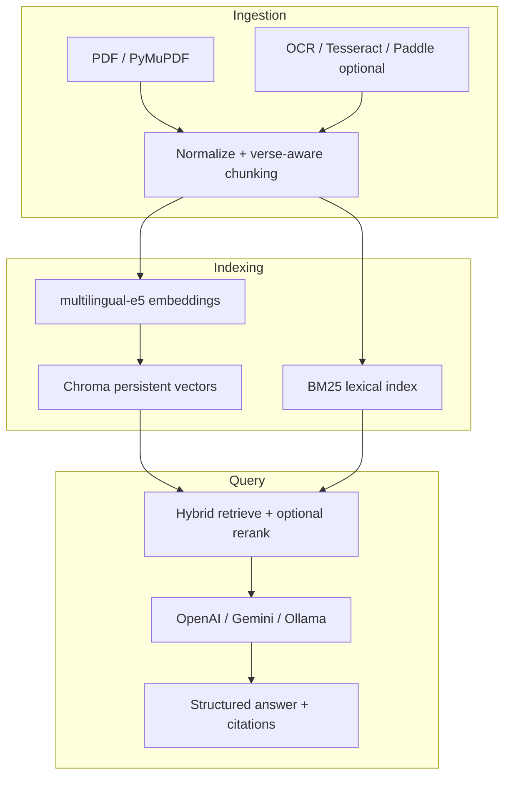

# AI Vaidya — System Architecture

## Overview

AI Vaidya is a **grounded RAG** platform: answers are constrained to retrieved passages from **your** ingested corpus (PDFs, OCR text, research PDFs). A **Sanskrit intelligence layer** enriches chunks with transliteration, verse boundaries, and Ayurvedic entity tags for retrieval and presentation.

## Multi-stage RAG

1. **Ingestion**: extract text (digital PDF) or OCR pipeline hooks (scanned pages).
2. **Preprocessing**: Devanagari-friendly whitespace, OCR noise heuristics, **shloka-aware** line grouping, semantic window chunking with overlap.
3. **Embeddings**: `intfloat/multilingual-e5-base` (configurable to `e5-large`, `bge-m3`) with E5 query/passage prefixes.
4. **Storage**: ChromaDB (default, hackathon-fast) + in-memory BM25; optional PostgreSQL + pgvector schema for production scale-out.
5. **Hybrid retrieval**: vector top-k ∪ BM25 top-k → dedupe → optional cross-encoder rerank.
6. **Generation**: strict system prompt: use **only** context; emit **7-part** answer schema + `confidence` from retrieval scores.

## Hallucination controls

- Retrieval-first: if no chunk exceeds minimum score threshold, API returns the explicit **not found** message (no LLM invention).
- Prompt requires **verbatim** or clearly attributed paraphrase from context for Sanskrit lines.
- Citations carry `chunk_id`, `source_path`, `page`, `score`.

## Sanskrit layer (extensible)

- Transliteration: `indic-transliteration` (Devanagari ↔ IAST).
- Verse detection: double danda, numbered pada patterns, line symmetry heuristics.
- Entity tagging: curated lexicon (Doshas, Dhatus, Gunas, Rasas, common herbs) — replace/expand with domain ontology or NER model.

## Deployment

- **Docker Compose**: API + Postgres (pgvector) + Next.js web.
- **Vercel**: frontend only; set `NEXT_PUBLIC_API_URL` to hosted API.
- **Railway / Render**: deploy `backend` as web service with volume for `chroma_data` + `uploads`.
- **HF Spaces**: Gradio/Streamlit wrapper optional; core API is FastAPI.

## Future hardening

- Replace BM25 memory index with OpenSearch/Elasticsearch for huge corpora.
- Add Indic NLP sandhi splitter (e.g. INLP/Digital Corpus pipelines) behind feature flag.
- Fine-tuned Sanskrit-aware embedder or ColBERT late interaction.
